# Lab6Web
Nama  : Bangkit Akbar Anggara 
NIM   : 312010148 
Kelas : TI.20.B.1 

# Tugas
Berikut adalah tugas praktikum 6 yang dimana kita menggunakan Twitter Bootstrap untuk meyerupai seperti tampilan berikut 
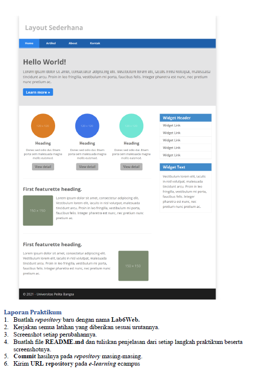

# Pengerjaan
1. Hal pertama yang harus kalian lakukan adalah membuat folder Lab6Web didalamnya harus terdapat 2 folder lagi yaitu Pictures untuk menyimpan gambar atau hasil screenshot dan Lab6_css_framework untuk folder bootstrap, html, dan cssnya. 
2. Selanjutnya mendownload bootstrap di <i>getbootstrap.com</i> atau klik disamping [Click Here](https://getbootstrap.com/) 
3. Setelah kalian download kalian extract rar atau zipnya, Setelah kalian extract pindahkan folder bootstrap kedalam Lab6_css_framework yang tadi kita buat 
4. Selanjutnya kita akan membuat htmlnya berikut dibawah ini adalah awal yang harus kalian buat, pastikan html dan css didalam folder Lab6_css_framework bersama dengan folder bootstrap 
   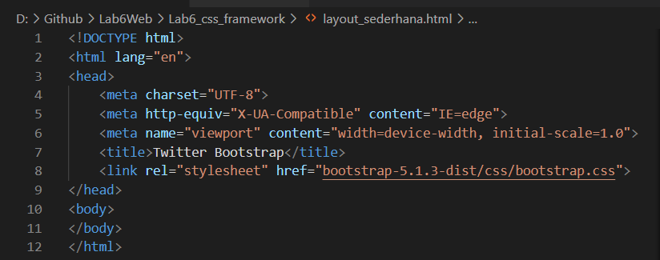 
   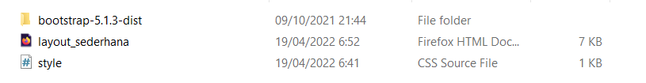 
5. Setelah itu kita tambahkan header dan juga navbarnya berikut adalah syntax yang harus kalian masukkan dibagian bawah body 
   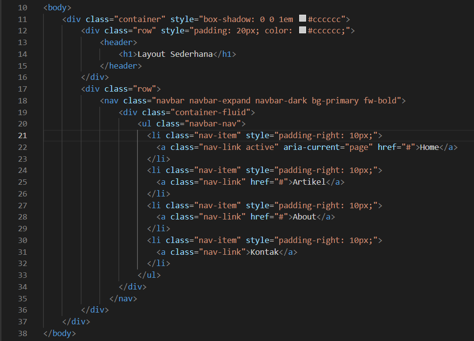 
   Maka Hasilnya akan menjadi seperti berikut 
   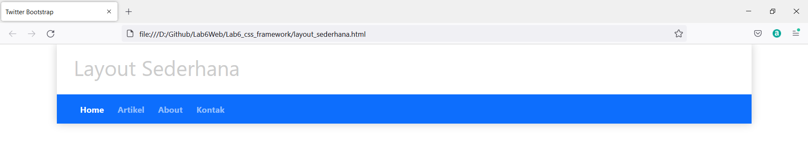 
6. Setelah itu kalian buat heronya seperti berikut 
   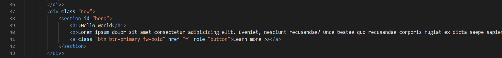 
   Maka hasilnya akan seperti berikut 
   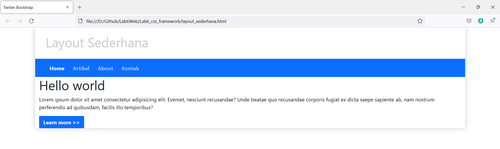 
7. Untuk mempercantik tampilan hero maka kita buatlah cssnya seperti berikut 
   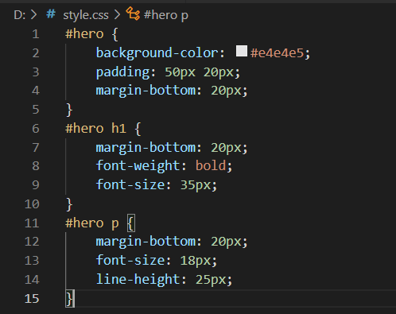 
8. Jangan lupa lakukan tag atau link pada html agar mau memanggil cssnya, cukup kalian tambahkan link pada bagian bawah bootstrap 
   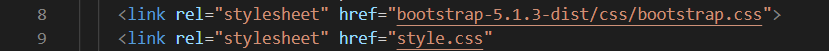 
   Maka hasilnya akan berubah seperti berikut ini 
   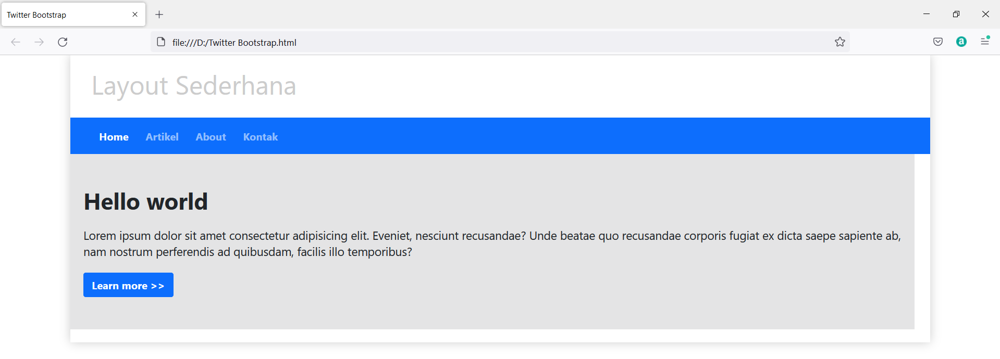 
10. Selanjutnya kalian buat Main content dan juga sidebarnya, saya akan membuat 9 kolom untuk main content dan 3 kolom untuk sidebarnya seperti berikut 
   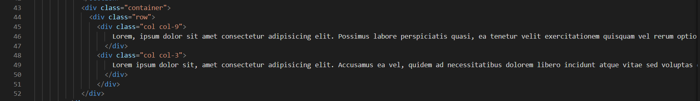 
   Maka hasilnya akan menjadi seperti berikut ini 
   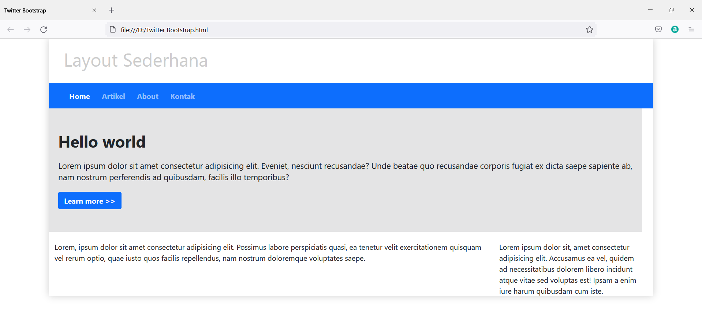 
11. Setelah itu kita akan menambahkan 3 buah lingkaran, berikut adalah syntaxnya 
   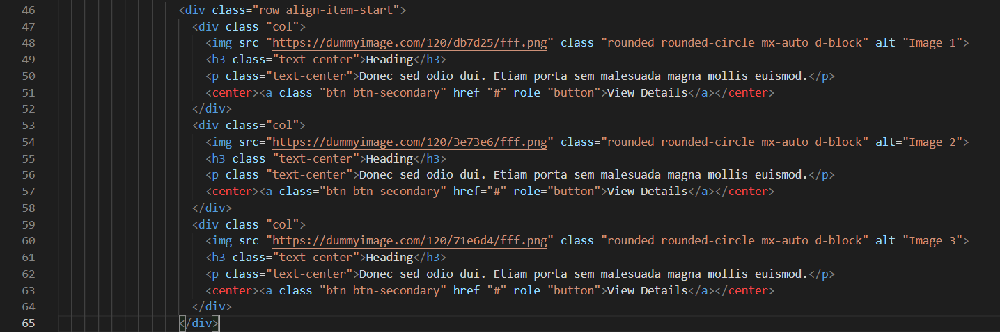 
   Maka hasilnya akan menjadi seperti berikut 
   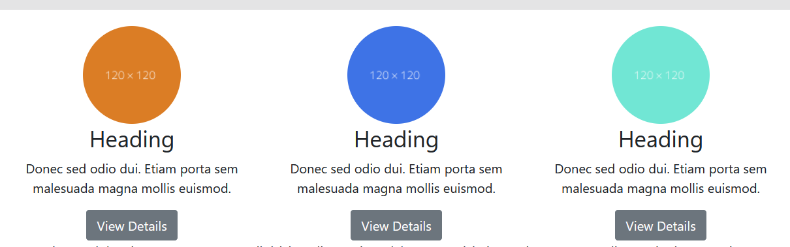 
12. Selanjutnya kita tambahkan 2 artikel lagi dibagian bawah linkaran, dan untuk gambarnya 1 ada di poisi kiri dan ke 2 dikanan.Disini saya menggunakan class clearfix untuk menghapus float, sehingga teks bisa berada pada sebelah gambar berikut adalah syntaxnya 
   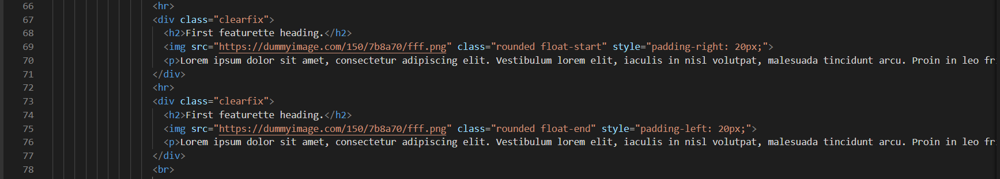 
   Maka hasilnya akan menjadi seperti berikut 
   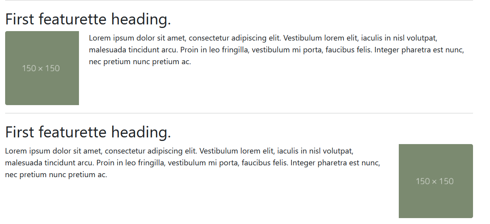 
13. Setelah itu kita lanjutkan ke bagian sidebar, berikut adalah syntaxnya 
   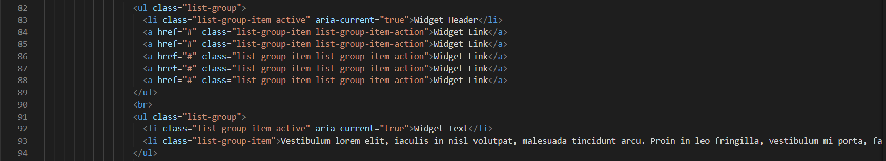 
   Maka hasilnya adalah seperti berikut ini 
   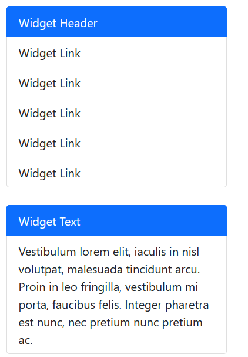 
14. Terakhir kita buat footernya dengan menggunakan card, berikut adalah syntaxnya 
   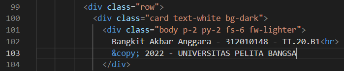 
   Maka hasilnya akan menjadi seperti berikut ini 
   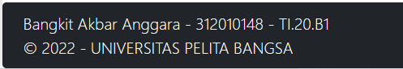 
   
Kalian bisa mengakses htmlnya dengan klik disamping [Click Here](Lab6_css_framework/layout_sederhana.html) dan disamping untuk cssnya [Click Here](Lab6_css_framework/style.css) 
Berikut adalah hasil final dari tugas praktikum 6 Lab6Web 
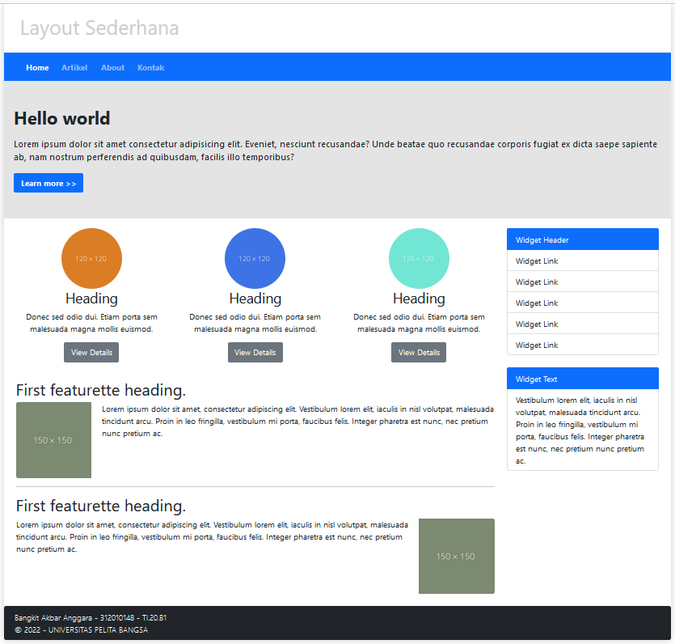 

#### Cukup Sekian Terimakasih
#### By: Bangkit Akbar Anggara - 312010148 - TI.20.B.1
